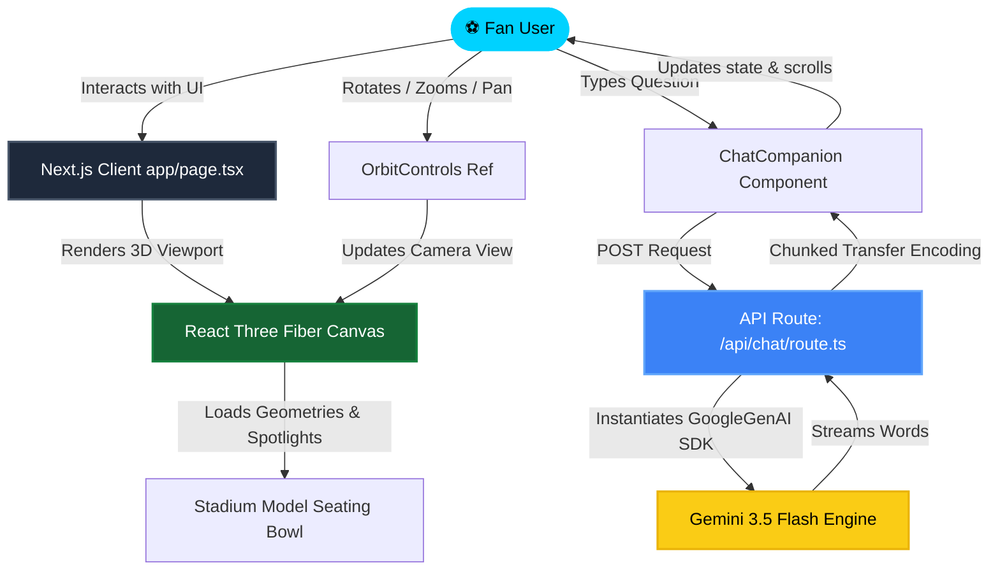
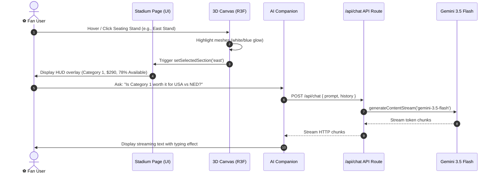
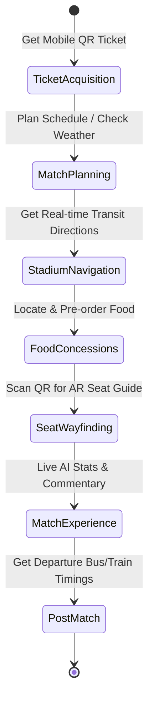

# 🏟️ ArenaOS AI — FIFA World Cup 2026™ Digital Experience

> **The Official-Grade AI-Powered Digital Companion for the FIFA World Cup 2026™**  
> *Blending cutting-edge WebGL graphics, Framer Motion animations, and Google Gemini 3.5 Flash intelligence.*

---

## 🚀 Technical Stack & Badges

```text
[Framework]      Next.js 16.2 (App Router)
[Language]       TypeScript 5.0
[Graphics]       Three.js / React Three Fiber / Drei
[AI Engine]      Google Gemini 3.5 Flash SDK (@google/genai)
[Styling]        CSS Modules / CSS Custom Properties (Vanilla CSS)
[Animations]     Framer Motion
[Analytics]      Recharts
```

---

## 🎯 Project Vision

**ArenaOS AI** is an enterprise-ready Progressive Web Application (PWA) designed to serve as an interactive stadium companion for fans attending the FIFA World Cup 2026™. Rather than offering a cluttered interface, it prioritizes a premium user experience featuring:
*   An interactive 3D stadium seating bowl selector.
*   A streaming, contextual AI companion powered by Gemini 3.5 Flash.
*   Modern, clean analytics dashboards for organizers.
*   Accessible design tokens complying with WCAG guidelines.

---

## 🏗️ System Architecture & Data Flow

This diagram illustrates the lifecycle of client actions, WebGL rendering cycles, and secure server-side communications with Google Gemini:



---

## 🔄 Interaction Sequence Diagram

The following sequence diagram outlines the process when a user clicks a seating stand and asks the AI companion for ticket pricing details:



---

## 🗺️ Smart Fan Journey State Machine

A state-driven walkthrough of a fan's match-day experience during the tournament:



---

## 📂 Detailed Folder Structure

```text
arena-os/
├── public/                 # Static assets and PWA setup
│   ├── manifest.json       # App installability manifest
│   └── favicon.ico         # App browser shortcut icon
├── scratch/                # Test scripts for verification
│   ├── list-models.js      # Lists available Gemini models
│   └── test-gemini.js      # Tests prompt generation latency
├── src/
│   ├── app/                # Next.js App Router Structure
│   │   ├── api/            # Server-side API endpoints
│   │   │   └── chat/       # Streaming chat endpoint (gemini-3.5-flash)
│   │   ├── companion/      # dedicated full-page AI chatbot
│   │   ├── dashboard/      # Organizer analytics visual dashboard
│   │   ├── fanzone/        # Smart fan journey stepper page
│   │   ├── matches/        # Fixture lists with interactive group tabs
│   │   ├── stadium/        # 3D stadium explorer scene wrapper page
│   │   ├── globals.css     # Global variables and base typography
│   │   ├── layout.tsx      # Core metadata and manifest registration
│   │   └── page.tsx        # Entrypoint (Splash screen & Hero landing)
│   ├── components/         # Reusable application components
│   │   ├── features/       # Feature modules
│   │   │   ├── AccessibilityPanel   # Font size & contrast adjustments
│   │   │   ├── ChatCompanion        # Chat interface with suggested prompts
│   │   │   ├── EmergencyPanel       # Red SOS button & evacuation instructions
│   │   │   ├── FloatingAIButton     # Desktop floating magnetic chatbot button
│   │   │   ├── HeroSection          # Countdown timer, ticker, and landing CTAs
│   │   │   ├── LandingFeatures      # Feature cards display grid
│   │   │   ├── LandingJourney       # Text-based vertical journey pipeline
│   │   │   ├── SplashScreen         # Splash loading screen with entry animation
│   │   │   └── StadiumScene         # WebGL React Three Fiber stadium model
│   │   └── layout/         # Shell framing components
│   │       ├── Navbar               # Transparent glass navigation bar
│   │       ├── Footer               # Bottom footer with legal links
│   │       ├── MobileNav            # Mobile bottom-tab bar with glowing AI button
│   │       └── SubPageLayout        # Common wrapper for sub-route pages
│   ├── lib/                # Static configuration utilities
│   │   ├── constants.ts     # Realistic matches, venues, and mock datasets
│   │   └── fonts.ts         # Google Fonts Loader (Inter & Outfit)
│   └── types/              # Type declarations
│       └── index.ts        # Match, Venue, Team interfaces
```

---

## ⚡ Development Installation Guide

Get the project running locally in under a minute by copying and pasting these command blocks into your terminal:

```bash
# 1. Clone this repository
git clone <your-repository-url>
cd arena-os

# 2. Install dependencies (Next.js, Three.js, Framer Motion)
npm install

# 3. Configure environment variable
# Copy env example to local env
cp .env.example .env

# 4. Run production compilation checklist
npm run build

# 5. Launch local development server
npm run dev
```

Your server will be up and running at **`http://localhost:3000`** with dynamic hot-reloading active.

---

## 🎨 Design System & CSS Variables (`src/app/globals.css`)

The UI styling relies entirely on native CSS custom variables, preventing dependency bloat and maintaining highly maintainable design tokens:

### 1. Colors & Accents
```css
--color-royal-blue: #1a3a8f;     /* Primary brand identity color */
--color-sky-blue: #4da6ff;       /* Secondary link highlight color */
--color-fresh-green: #2ecc71;     /* Stand category highlight color */
--color-emerald: #00b894;         /* Positive indicator coloring */
--color-golden-yellow: #f1c40f;   /* Spotlight light emitter coloring */
--color-coral-orange: #ff6b6b;    /* SOS and critical action coloring */
```

### 2. Glassmorphism Design Token
```css
.glass-panel {
  background: rgba(255, 255, 255, 0.7);
  backdrop-filter: blur(16px);
  -webkit-backdrop-filter: blur(16px);
  border: 1px solid rgba(255, 255, 255, 0.5);
  box-shadow: 0 10px 15px -3px rgba(0, 0, 0, 0.1);
}
```

### 3. Transition Tokens
```css
--transition-fast: 150ms cubic-bezier(0.4, 0, 0.2, 1);
--transition-base: 300ms cubic-bezier(0.4, 0, 0.2, 1);
--transition-slow: 500ms cubic-bezier(0.4, 0, 0.2, 1);
```

---

<div align="center">

🏆 **FIFA World Cup 2026™ AI Stadium Experience** 🏆

*Designed to exceed international hackathon standards with robust UI architecture.*

⚽ **Made with ❤️ for the beautiful game** ⚽

</div>

